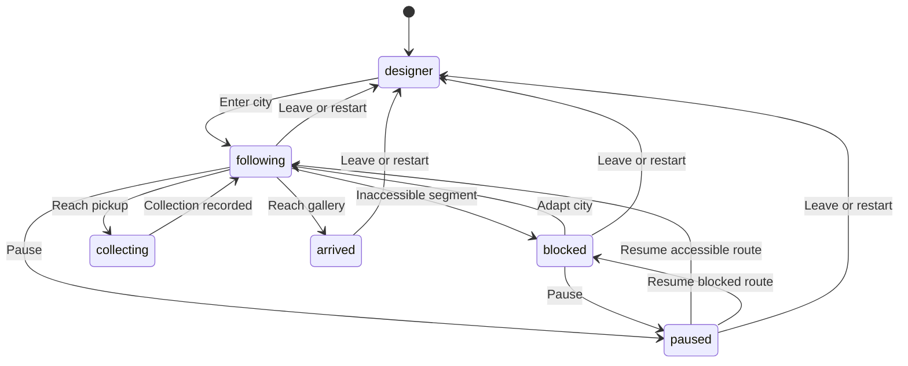

# Robot state and musical event data

Every cached ArtBot owns a JSON-compatible `record` with schema version 1. Its state and accumulated history stay with the bot when users navigate between designs or return to the designer. Newly generated bots start with empty histories. Records currently last for the page lifetime; IndexedDB persistence and user downloads remain separate future work.

`robot/robotState.ts` defines the record and `RobotStateMachine`. `simulation/cityJourney.ts` drives it from actual navigation and user interventions. The record is also available on the Babylon robot's metadata. Scene objects, audio nodes, functions, and Sets are excluded from the record.

## States



The controller validates transitions and records state changes. Collecting is an instantaneous logical state. Restart ends the previous run and starts another; city improvements persist. Leaving marks an unfinished run interrupted, without adding a failure. Completed runs retain their completed status.

## Record contents

| Field | Contents |
| --- | --- |
| `metadata` | Current ID, name, appearance and colour, size and shape, allocated and effective abilities, enabled functions, four-wheel locomotion |
| `state`, `clock` | Current logical state and cumulative simulation seconds |
| `telemetry` | Latest route segment, XYZ position, nominal travel speed, progress from 0 to 1; null before the first journey |
| `metrics` | Lifetime distance, steps, segments, moving/blocked/paused time, failures, interventions, pickup count/value, journeys started/completed |
| `runs` | Immutable configuration snapshot at entry, route ID, initially accessible features, start/end times, active/completed/interrupted status, run metrics, collected items |
| `failures` | Environmental barrier encounters, run ID, encounter time, and resolution time when adapted |
| `achievements` | First access improvement, first pickup, gallery arrival, and an uninterrupted route; each earned once per bot |
| `events` | Ordered state changes, run starts/ends, distance steps, segment completions, barrier stops, interventions, pickups, achievements, and arrival |

Failures count unsuccessful attempts to enter an inaccessible route section, rather than attributing fault to the bot. Waiting at the same barrier does not repeatedly add failures. Each pickup is collected once per run; restarting replenishes it. Three visible art fragments at the crossing, river, and upper terrace currently exercise collection, with values 1, 2, and 3.

For a wheeled robot, one **step** is one city distance unit travelled, including vertical elevator travel. This is a musical distance milestone, not a leg movement or a rendered frame. Event positions and times are calculated at the exact milestone, so frame frequency does not change their rhythm. Partial final distance remains in `distance` and does not count as a whole step. All distances and thresholds use fictional game units.

`clock` advances during movement, blocked waiting, and explicit pauses in an active city view. Time after arrival, while the city is hidden, or in the designer is excluded. `time` is the bot's lifetime simulation clock; `runTime` is relative to entry into that run. The record uses simulation seconds rather than wall-clock timestamps.

## Stage 3 consumption

`journey.stepCounter` exposes the current run's whole-unit travel counter. Its stored variable is `journey.metrics.stepsTaken`; lifetime totals are in `bot.record.metrics.stepsTaken`. One step equals `TRAVEL_UNITS_PER_STEP` (currently 1 city unit). Fractional travel accumulates toward the next step, while pauses and blocked waiting add no steps.

Every event carries a stable sequence number, bot ID, run ID, state, simulation time, run-relative time, segment, XYZ position, and typed event payload. Barrier events include the barrier ID; pickup events include item ID, kind and value. Run metadata preserves the configuration that actually travelled, even if the bot is later renamed or tuned.

```ts
// Poll from the creative HUD without consuming or modifying the source history.
const newEvents = journey.machine.eventsSince(lastSequence);
for (const event of newEvents) {
  // A future composer can map steps to rhythm, pickups to motifs,
  // environmental stops to tension, and interventions to resolution.
  composer.accept(event);
  lastSequence = event.sequence;
}

// Detached snapshot for composition, JSON persistence, or later export.
const scoreInput = journey.machine.snapshot();
const json = JSON.stringify(scoreInput);
```

Snapshots and event batches are detached copies. Stage 3 can therefore process them without changing simulation state. Use run-relative event times to replay a run, retain blocked intervals to express the journey's waiting, and choose explicitly whether paused intervals should become silence or be removed during composition. Existing mood audio only reacts to barrier stops, interventions, pickups, and arrival; distance and state events do not trigger the arrival sound.

Tests verify transitions, timing and frame independence, single encounter/pickup counting, resolved barriers, run archives, lifetime aggregation, independent cached bots, metadata snapshots after rename, achievements, and JSON roundtrips.
